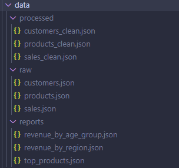
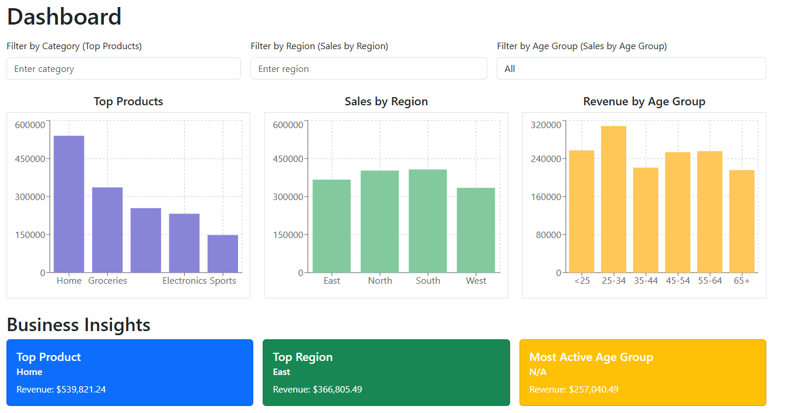

*ETL Pipeline*

Description: This ETL pipeline generates synthetic data, processes it, and produces business insights for analysis. It is composed of three main Python scripts: generate_data.py, etl_pipeline.py, and insights.py.

The pipepine will generate for types of files in diferente folders

Environment Variables: The pipeline uses a .env file with the following variables:
* DATA_DIR=./data → Directory where input/output data files are stored.
* LOG_DIR=./logs → Directory where logs are saved.
* NUM_CUSTOMERS=100 → Number of synthetic customers to generate.
* NUM_PRODUCTS=50 → Number of synthetic products to generate.
* NUM_SALES=500 → Number of synthetic sales records to generate.
* LOG_LEVEL=INFO → Logging level (e.g., DEBUG, INFO, WARNING).

Running the ETL Pipeline:
1. Make sure Python 3 is installed.
2. Install required packages: pip install -r requirements.txt
3. Ensure the .env file exists in the root directory with the variables above.
4. Run the ETL pipeline using the provided shell script:
   ./run_etl.sh
   This will execute the scripts in order:
   - generate_data.py → generates synthetic data files.
   - etl_pipeline.py → processes the data and performs transformations.
   - insights.py → generates business insights from the processed data.

Running pipeline:
- Go to the root directory and run python -m src.main

Running Tests:
- To run the test type pytest -v

Logs:
- Logs are stored in the directory specified by LOG_DIR.
- The logging level is controlled by LOG_LEVEL in the .env file.

Notes:
- Ensure the DATA_DIR and LOG_DIR directories exist or are created before running the pipeline.
- Adjust NUM_CUSTOMERS, NUM_PRODUCTS, and NUM_SALES in the .env file to generate larger or smaller datasets.

*API Backend*

Description: This is a Node.js/Express backend that provides endpoints to serve metrics data for the dashboard. The API reads data from JSON files and returns structured information for top products, sales by region, and sales by age group.

Environment Variables: The API uses a .env file with the following variables:
* PORT=5000
* DATA_DIR=../etl/data/reports

Available Endpoints:
- GET /top-products → Returns top products with category and revenue.
- GET /sales-by-region → Returns sales revenue grouped by region.
- GET /sales-by-age-group → Returns sales revenue grouped by age group.

Running the API:
1. Make sure Node.js (v18+) and npm are installed.
2. Install dependencies: npm install
3. Ensure the .env file exists in the root directory with the variables above.
4. Start the server:
   npm run dev
   By default, the server runs on http://localhost:5000/api

Logs:
- API logs are saved in the directory specified by LOG_DIR.
- The logging level is controlled by LOG_LEVEL in the .env file.

Error Handling:
- Errors in data reading or endpoint execution are logged to the console and written in the logs directory.
- API responses include appropriate HTTP status codes for success (200) and errors (500).

Testing:
- Unit tests can be run with Jest:
  npm test
- Tests include API endpoints, data fetching, and response mapping.

*Frontend React Dashboard*

Description: This is a React 20 frontend dashboard that visualizes metrics data from the API. It shows three charts: top products, sales by region, and sales by age group. The dashboard also provides filters for category, region, and age group, and displays business insights.

Environment Variables: The frontend uses a .env file with the following variables:
* VITE_API_BASE_URL=http://localhost:5000/api → Base URL of the backend API.
* VITE_API_TIMEOUT=5000 → Request timeout in milliseconds.

Running the Frontend:
1. Make sure Node.js (v18+) and npm are installed.
2. Install dependencies: npm install
3. Ensure the .env file exists in the root directory with the variables above.
4. Start the development server:
   npm run dev
   By default, the frontend runs on http://localhost:5173

Features:
- Three interactive charts (Top Products, Sales by Region, Sales by Age Group) using Recharts.
- Filters for category, region, and age group to dynamically update charts.
- Business insights automatically calculated from the metrics data.
- Responsive design for desktop and mobile devices.

Error Handling:
- API request errors are logged in the console with descriptive messages.
- UI shows error messages if data cannot be loaded.

Testing:
- Unit tests are implemented with Jest and React Testing Library.
- Run tests with:
  npm test
- Tests cover components, charts rendering, filters functionality, and API calls.

Notes:
- Ensure the backend API is running before starting the frontend to fetch metrics correctly.
- Logs from API calls are printed in the browser console for debugging.
